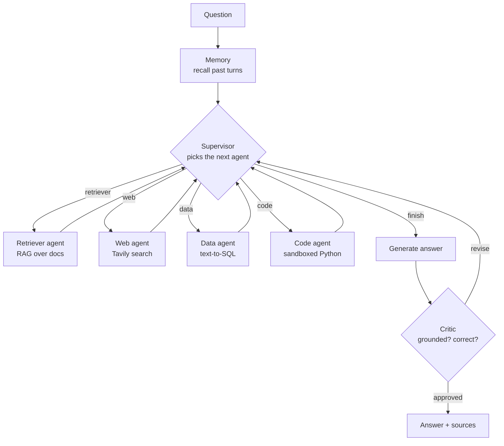

# Multi-Agent AI Analyst

A supervisor-led team of AI agents that plans, uses real tools, checks its own
work, and proves it works.

A single RAG agent can only retrieve and answer. A question like *"How many
customers churned in Q3 2024, and why?"* needs a **database query** for the
number and **document retrieval** for the reasons — no single tool answers it.
This system routes to the right specialist, collects the results, and runs a
**critic** over the draft answer before the user ever sees it.

**Stack:** LangGraph · Gemini · Qdrant · SQLite · sandboxed Python · Tavily ·
Langfuse · FastAPI · plain HTML/CSS/JS frontend
**Cost:** $0, no credit card anywhere.

---

## The graph



Termination is guaranteed four independent ways, so a mis-route can never loop
forever: the supervisor is told which agents already ran, a step budget forces
`finish` after `MAX_GRAPH_STEPS`, the critic may only bounce an answer
`MAX_REVISIONS` times, and LangGraph's own `recursion_limit` is the backstop.

---

## Quick start

You need **one key**: the `sk-…` key your class issued for the shared LiteLLM
proxy. You do *not* need a Google AI Studio key — the proxy holds the upstream
credentials. Everything else is optional.

```powershell
cd backend

# 1. environment
python -m venv .venv
.\.venv\Scripts\Activate.ps1
pip install -r requirements.txt

# 2. your key  (backend\.env already exists — just paste the key into it)
notepad .env          # set GEMINI_API_KEY=sk-...

# 3. check everything offline, then confirm the key and its model access
python smoke_test.py     # 14 offline checks, no API calls
python verify_key.py     # 3 tiny calls: chat, reasoning, embedding
python pick_model.py     # which models this key may actually call

# 4. build the demo database and index the documents
python data\seed_db.py
python ingest.py --test

# 5. run the API
uvicorn main:app --reload --port 8000
```

Then open `index.html` in your browser (double-click it, or serve it with
`python -m http.server 5500` from the project root and visit
`http://localhost:5500`).

> On macOS/Linux the only difference is `source .venv/bin/activate` and forward
> slashes in paths.

### Try these

| Question | Agents it should use |
|---|---|
| What is the refund policy? | retriever |
| How many customers churned in Q3 2024? | data |
| …and what percentage of all customers is that? | data → code |
| …and what does the postmortem say caused it? | data → retriever |
| What is 2500 at 4.5% compounded for 7 years? | code |

The last few are the point of the project: watch the trace panel and you'll see
the supervisor call two different specialists before the critic signs off.

---

## Model access will bite you — read this

All traffic goes through the **class LiteLLM proxy**
(`https://saidazam-litellm-proxy.hf.space`), which speaks both an
OpenAI-compatible surface (`/v1`) and a native Gemini one (`/gemini`). You use an
`sk-…` proxy key, *not* a Google AI Studio key. This replaced the earlier
direct-to-Google setup, and it changes the constraint completely.

**The proxy key is scoped to a list of model names, and the list is shorter than
the code originally assumed.** This key is authorised for exactly:

```
flash-lite   gemini-flash-lite   gemini-embedding
```

Asking for anything else — including `gemini-flash` — returns a `403
key_model_access_denied` naming the models you *are* allowed. Always confirm
before a long run:

```powershell
python verify_key.py     # chat + reasoning + embedding round-trip, ~3 calls
python pick_model.py     # which chat models this key can actually reach
```

This matters more than it sounds. The critic and supervisor were written to run
on `gemini-flash` precisely because a lite model approves SQL whose denominator
is wrong. With `gemini-flash` unreachable, `REASONING_MODEL` has to fall back to
`gemini-flash-lite`, and one critic regression case fails as a direct result —
see [the critic caveat](#a-caveat-on-the-critic-the-strong-model-is-gone) below.
If your key *does* have `gemini-flash`, set `REASONING_MODEL=gemini-flash` and
that case passes.

Also worth knowing:

- **Quota is shared, not per-model-per-day.** The old advice — "switch models for
  a fresh daily allowance, resets midnight US Pacific" — was about Google's free
  tier and no longer applies. The proxy is a shared class resource: a rate limit
  here means *someone else* is also running, and switching model names does not
  buy you a fresh bucket. Retry after a minute.
- **Embedding dimensions must match the Qdrant collection.** `gemini-embedding`
  returns **3072** through the proxy. `verify_key.py` prints the actual number.
  If you change embedding model, delete `qdrant_data/` and re-ingest, or every
  insert fails with a dimension error.
- **Latency is the real budget now.** A question costs 5–6 LLM calls and about
  **30 s** through the proxy. The full `--ablation` is 28 question-runs plus
  RAGAS scoring — plan on roughly 20–30 minutes, and don't start it if you need
  the machine.
- **Budget your runs.** `python eval\evaluate.py --limit 4` gets you a real
  metrics table quickly. Run the full `--ablation` once, when you are ready to
  submit.

Known-good configuration as of this writing:

```
LLM_MODEL=gemini-flash-lite
REASONING_MODEL=gemini-flash-lite   # gemini-flash if your key allows it
EMBEDDING_MODEL=gemini-embedding
EMBEDDING_DIM=3072
```

---

## Repository layout

```
backend/
  config.py         F1  every key and limit, loaded from .env
  state.py          F1  the AgentState that flows through every node
  llm.py                cached Gemini chat + embedding clients
  vectorstore.py    F2  embedded Qdrant (no server, no signup)
  ingest.py         F2  load -> chunk -> embed -> store
  agents.py         F3-F6  the four specialists, each runnable alone
  sandbox.py        F6  deny-list + child process + hard timeout
  memory.py         F10 long-term memory over past turns
  graph.py          F7-F9  supervisor, critic, and the wiring
  tracing.py        F12 optional Langfuse callbacks
  main.py           F13 FastAPI + Server-Sent Events
  smoke_test.py         14 offline checks, no API key needed
  verify_key.py         confirms your key + model + embedding dimension
  list_models.py        what your key can actually use
  pick_model.py         which model still has free quota today
  test_critic.py        F8  proves the critic rejects 3 kinds of bad answer
  eval/
    testset.json    F11 14 graded questions with reference answers
    evaluate.py     F11 LLM-judge + metrics + with/without-critic ablation
    ragas_metrics.py F11 the four RAGAS metrics, implemented locally
    score_ragas.py  F11 optional: the literal RAGAS library, in .venv-eval
  data/
    seed_db.py          builds company.db (240 customers, 43 churn events)
    docs/               the knowledge base the retriever searches
index.html          F13 the whole frontend, one self-contained file
render.yaml             free backend deploy, no credit card
```

---

## Testing each piece on its own

The rubric awards F3–F6 for agents demonstrated **in isolation**:

```powershell
python smoke_test.py        # 14 offline checks — no API key, no quota spent
python agents.py            # runs all four specialists alone, prints their output
python graph.py "How many customers churned in Q3 2024, and why?"
python ingest.py --test     # proves similarity search returns relevant chunks
python memory.py --reset    # wipe stored turns before a demo or graded run
python test_critic.py       # F8: proves the critic rejects 3 kinds of bad answer
```

`test_critic.py` is the cheap way to re-check the quality gate: it drives the
critic node directly with known-bad answers (wrong number, wrong SQL denominator,
hallucination) plus one good one — 4 LLM calls instead of the ~24 a full graph
run would cost.

**Reset memory before any graded run.** Memory is persistent and unfiltered: a
wrong answer from an earlier run is recalled on later follow-ups and repeated
confidently. That is how failure #3 below stayed hidden. The eval harness passes
`store_memory=False` for the same reason — a graded answer must not leak into
memory and contaminate a later question in the same run.

`smoke_test.py` is worth running first every time — it catches a missing key, an
unseeded database or a broken install in two seconds instead of halfway through
a demo.

---

## Evaluation (F11)

```powershell
python eval\evaluate.py --ablation
```

No extra install needed. This scores 14 questions three ways and writes a
timestamped Markdown table to `eval/results/`:

- **LLM-as-judge** — 1–5 against a reference answer, plus a strict correct/incorrect flag
- **RAGAS metrics** — faithfulness, answer relevancy, context precision, context recall
- **Routing accuracy** — did the supervisor call the agent the question needed?

`--ablation` runs the whole set a second time with the critic removed, producing
the **with vs without the critic** comparison the guide requires as a submission
visual. Use `--limit 4` for a quick run that doesn't burn the day's quota.

### Why the metrics are implemented, not imported

`eval/ragas_metrics.py` computes the four RAGAS metrics directly. This was not a
shortcut — **the RAGAS library cannot run on this stack, in any version:**

| Version | Blocker |
|---|---|
| all | hard-imports `langchain_community.chat_models.vertexai`, removed in langchain-community 0.4 — cannot be imported beside LangChain v1 |
| 0.3.x, 0.4.x | require `scikit-network`: no Python 3.14 wheel, needs MSVC C++ Build Tools |
| 0.2.x | isolated in its own venv, then fails at runtime on Python 3.14: `RuntimeError: Timeout should be used inside a task` (its async executor predates 3.14) |

Downgrading the entire project to LangChain 0.3 to satisfy a metrics library
would be the tail wagging the dog, so the four measurements are computed locally
following the definitions from the RAGAS paper. Same metrics, no dependency
cliff, and each one is readable in ~20 lines instead of being a black box.

**If your mentor requires the literal library**, `eval/score_ragas.py` runs it in
the isolated `.venv-eval`. That path is already wired up and will work on Python
3.12 or older — it fails only on 3.14. Both stages write to `eval/results/`, so
you can present either or both:

```powershell
python eval\evaluate.py                                  # stage 1: run + score
.\.venv-eval\Scripts\python.exe eval\score_ragas.py      # stage 2: literal RAGAS
```

### Results

Full ablation, **14 questions × 2 arms, 2026-07-30**, `LLM_MODEL` and
`REASONING_MODEL` both `gemini-flash-lite` via the class proxy. No quota errors —
every row completed, so unlike the earlier 2026-07-28 run these numbers are
clean and submittable.

| Metric | With critic | Without critic |
|---|---|---|
| Questions | 14 | 14 |
| Avg judge score | 4.43 | 4.43 |
| Accuracy % | 92.9 | 92.9 |
| Routing accuracy % | **100.0** | **100.0** |
| Avg revisions | 0.14 | 0 |
| Avg latency (s) | 40.0 | 31.8 |
| Faithfulness | 1.000 | 1.000 |
| Answer relevancy | 0.898 | 0.898 |
| Context precision | 0.798 | 0.798 |
| Context recall | 0.804 | 0.804 |

**13 of 14 questions correct in both arms. Routing was perfect** — every question
reached the right specialist, which is the supervisor's whole job and the thing
earlier runs got wrong (findings #4 and #5).

#### Read the ablation honestly: the critic changed nothing

The two arms score **identically** on judge score and accuracy. The critic cost
**+8.2 s per question** and altered no final outcome. That is not the result the
architecture predicts, so it is worth being precise about why rather than
burying it:

- On 13 of 14 questions the critic approved the first answer, so there was
  nothing to change.
- On the 14th (`multi-1`) it fired twice, diagnosed the fault **correctly**, and
  still could not fix it — see finding #7 below. Both arms score 1/5 there.

So this run demonstrates the critic is not *harmful* (it never rejected a good
answer — no false positives in 28 gradings) but it does **not** demonstrate that
it improves quality. Claiming otherwise from this data would be wrong.

#### Two metric caveats a grader would probe

**Why some numbers are identical to three decimals.** `context_precision` and
`context_recall` are byte-identical across arms because they measure *retrieval*,
and the critic does not change what was retrieved — only the answer written from
it. So identical retrieval metrics are the correct result, not a copy-paste bug.
`answer_relevancy` is a genuine coincidence: the per-question values do differ
(0.825 vs 0.821 on q1, 0.971 vs 0.964 on q5), and the means are 0.898429 vs
0.898071 — they collide only after rounding.

**Faithfulness = 1.000 on all 28 rows is suspiciously perfect.** A metric that
never fires is not evidence of quality; it is usually evidence that the metric is
too lenient. The honest reading is that nothing the system said was
*contradicted* by its evidence — a real but weak property. It says nothing about
whether the evidence answered the question, which is exactly where `multi-1`
fails while still scoring faithfulness 1.0. Do not present this as the headline.

Raw output: `eval/results/results-20260730-125232.json` (+ `.md`).

---

## Observability (F12)

Optional. Add Langfuse keys to `.env` and every LLM call, tool call and token
count is traced automatically:

```
LANGFUSE_PUBLIC_KEY=pk-lf-...
LANGFUSE_SECRET_KEY=sk-lf-...
LANGFUSE_HOST=https://cloud.langfuse.com   # EU. US region: us.cloud.langfuse.com
```

The host **must match the data region you signed up in**, or the keys
authenticate against the wrong server and traces silently never arrive. Check the
wiring before hunting for missing traces:

```powershell
python -c "import config, tracing; from langfuse import get_client; print(config.LANGFUSE_ENABLED, get_client().auth_check())"
```

Then ask one multi-part question and open the trace. `tracing.traced_run()` gives
each run a single well-formed trace rather than whatever LangGraph names its root
chain.

### What a good trace looks like here

Verified against a real run of *"How many customers churned in Q3 2024, what
percentage of all customers is that, and what does the postmortem say caused
it?"* — 29 observations, 39.3 s:

| Observation | Type | Model | In → out tokens |
|---|---|---|---|
| `answer-question` | span (root) | — | — |
| `route-question` ×3 | generation | gemini-flash-lite | 1456→44, 653→46, 482→39 |
| `write-sql` | generation | gemini-flash-lite | 983→126 |
| `compose-answer` | generation | gemini-flash-lite | 1175→111 |
| `verify-answer` | generation | gemini-flash-lite | 1485→40 |
| `VectorStoreRetriever` | retriever | — | — |
| `memory`, `supervisor`, `data`, `retriever`, `generate`, `critic` | span | — | — |
| | | **total** | **6,234 → 406** |

Three things were fixed to get there, each of which fails **silently** — the run
succeeds and the trace is simply wrong or absent:

1. **`flush()` was a no-op on SDK v4.** The old code probed `handler.flush()` and
   `handler.client.flush()`; v4's `CallbackHandler` has *neither*, so both
   branches missed and nothing was ever flushed. v4's only working route is the
   singleton: `get_client().flush()`.
2. **Credentials must be in `os.environ` before the first client is built.** The
   SDK caches a *disabled* client if the keys are not visible when it is first
   touched, logs one auth warning, and then drops every event. `tracing.py` now
   exports them at import time.
3. **Every generation was titled `ChatOpenAI`.** Six identical rows, no way to
   tell routing from verification. The chat models now take a verb-first role
   name (`route-question`, `write-sql`, `verify-answer`, …), which is what the
   table above shows.
4. **The API endpoints produced worse traces than the CLI.** Trace context is
   **thread-local**, and `/ask` and `/ask/stream` run the graph on a worker
   thread (LangGraph's `.stream()` blocks, so it cannot sit on the event loop).
   A span opened in the request coroutine therefore never became the parent of
   the spans that thread created. Frontend traces came out named `LangGraph`
   with the root *output echoing the question back* instead of the answer.
   Verified fix — same question before and after:

   | | Trace name | Root output |
   |---|---|---|
   | before | `LangGraph` | `{'question': …}` |
   | after | `answer-question` | `{'answer': …}` |

   Both endpoints now open the span **inside** the worker thread.

### Cost shows as $0 — and that is correct here

Tokens are captured, but `totalCost` is 0. Langfuse derives cost by matching the
generation's model name against a model-definition price table, and
`gemini-flash-lite` is the **proxy's alias**, not a canonical Google model id, so
no price matches. Since the class proxy pays upstream and you are not billed per
token, $0 is also the honest number for you. If you want cost modelled anyway,
add a custom definition under *Project Settings → Models* (user-defined models
take priority over Langfuse's built-ins) — but do not invent per-token prices for
a submission.

F12 asks for a trace showing the full agent path *with token counts*. Both are
present above, and the deliverable screenshot is `evidence/f12-langfuse-trace.jpg`
— captured from the **deployed** backend rather than a local run, so it proves
tracing survives the deploy:

```
answer-question  28.34s        tag: multi-agent-analyst
└ LangGraph      28.33s        7,974 prompt → 499 completion  (Σ 8,473)
  ├ memory       15.84s   ├ retriever   0.80s   ├ supervisor  0.73s
  ├ supervisor    1.40s   ├ supervisor  0.94s   ├ generate    0.89s
  ├ data          5.14s   ├ code        0.87s   └ critic      0.83s
  └ supervisor    0.80s
```

Three specialists and four supervisor decisions in a single question. Note
`memory` at 15.84 s — over half the wall time, because a cold Qdrant read on
Render's free tier dominates a run where every LLM call is under a second.

One instrumentation gap the screenshot makes visible: the root span shows
`Input: null` / `Output: undefined`, because the graph is invoked with the state
dict and Langfuse records the payload on the `LangGraph` child rather than the
wrapper. The path and tokens are what F12 grades, but setting the root span's
input/output explicitly would make the trace read better.

---

## Deployment (F14)

**Live now — both free, no credit card anywhere:**

| | URL |
|---|---|
| **Frontend** | https://shahzodo5o4.github.io/multi-agent-ai-analyst/ |
| **Backend** | https://multi-agent-analyst-api.onrender.com |
| Health | https://multi-agent-analyst-api.onrender.com/health |
| Source | https://github.com/Shahzodo5o4/multi-agent-ai-analyst |

Deployed from `render.yaml` as a Render Blueprint, frontend on GitHub Pages from
the same repo. `/health` reports which optional services are live, including
`web_enabled` — that flag is simply `bool(TAVILY_API_KEY)`, so it tells you
whether the deployed instance can search the web at all.

> **If you enable web search on a public URL, the quota is public too.** Tavily's
> free tier is 1000 searches/month and this API has no auth or rate limit in
> front of it, so anyone who finds the URL can spend that budget. It is fine for
> a graded demo; it is not fine to leave running indefinitely.

**The first request after a pause takes ~30 s.** Render's free tier spins the
instance down after 15 minutes of inactivity; a cold `/health` measured 11.2 s
and the warm three-specialist question below took 36 s. Hit `/health` first if
you are demoing.

Verified against the public URL on 2026-07-30 — `evidence/f14-render-live-run.json`:

```
 1. memory (no relevant history)     6. supervisor → code
 2. supervisor → data                7. code
 3. data/sql                         8. supervisor → finish
 4. supervisor → retriever           9. generate
 5. retriever (4 chunks)            10. critic → approved ✅   (0 revisions)
```

Three specialists on one question, approved first pass, and the 25 churned
customers match the ground truth in F5.

The deployed instance runs with `web_enabled: true`, so the fourth specialist is
reachable in production too — a live-search question through the same public URL
routed `memory → supervisor → web → generate → critic ✅` in 31 s with 4 cited
sources (`evidence/f4-web-agent-deployed.json`). All four specialists and the
critic are therefore exercised on the deployed system, not only locally.

Both routes below are free and need **no credit card**.

**Easiest — Google Colab, ~5 minutes.** Upload the `backend` folder, then:

```python
!pip install -q -r backend/requirements.txt pyngrok
%cd backend
import os; os.environ["GEMINI_API_KEY"] = "sk-your-proxy-key"
!python data/seed_db.py && python ingest.py
!nohup uvicorn main:app --port 8000 &
from pyngrok import ngrok; print(ngrok.connect(8000).public_url)
```

Note the key is set **before** `ingest.py` — indexing needs the embedding API, so
the original ordering failed on the first chunk. `deploy_colab.ipynb` does this
properly via Colab Secrets and is the route to prefer.

Paste that public URL into the **Backend** box at the top of `index.html`. Colab
has ~12 GB RAM, so everything fits comfortably.

**Always-on — Render + GitHub Pages.** This is what the live URLs above run on.
`render.yaml` is included: Render dashboard → New → Blueprint → pick the repo →
set `GEMINI_API_KEY` (your `sk-` proxy key) when prompted. The build seeds the
database and runs `ingest.py`, so the deployed instance comes up with its 7
chunks already indexed — `knowledge_base_ready: true` on `/health`. Serve
`index.html` from the same repo via Settings → Pages → branch `main`, folder
`/ (root)`; the **Backend** box defaults to the Render URL and falls back to
`localhost:8000` when the page is opened locally.

> Render's free tier is **512 MB RAM**. Keep `EMBEDDING_MODEL` on the Gemini API
> model (the default) rather than a local model, or the instance will be OOM-killed.

---

## Security notes

Two places where a naive implementation would be genuinely dangerous, and what
this one does instead:

**Text-to-SQL (F5).** A generated query is never trusted. `agents.guard_sql()`
requires the statement to begin with `SELECT` or `WITH`, rejects stacked
statements (`SELECT 1; DROP TABLE users`), and scans for a deny-list of
`INSERT/UPDATE/DELETE/DROP/ALTER/ATTACH/PRAGMA/...`. `smoke_test.py` asserts all
seven attack shapes are blocked.

**Code execution (F6).** `PythonREPLTool` runs `exec()` inside your API process —
an infinite loop hangs the server and `os.remove` deletes your files. Instead
`sandbox.py` layers three defences: a static deny-list on imports, dangerous
builtins and dunder access; execution in a separate isolated child process; and
a hard timeout that kills it.

**This is a capstone-grade sandbox, not a production one.** The child process
still has network access and normal filesystem permissions at the OS level — the
deny-list is what stops the code reaching them, and a determined attacker with
arbitrary prompt control could probably find a gap. Before exposing this
publicly you'd move execution into a container with no network, or a service
like E2B or Modal.

---

## Error analysis

Eight failures found while testing this system, each traced to a specific agent
or to the graph itself. All were real defects, not tuning problems. Six are
fixed; **#7 and #8 are diagnosed and open** — both are architectural rather than
prompt-level, and both are written up in full below.

### 1. Specialists could not resolve follow-up references — *data agent*

**Question:** "And what percentage of all our customers is that?" (after asking
about Q3 2024 churn)

**Symptom:** answered 17.9%, which is 43/240 — *all-time* churn, not Q3's 25.

**Cause:** memory was recalled into state and given to the supervisor, but the
data agent's SQL prompt never received it. With no antecedent for "that", it
silently picked a different subject. The supervisor knew the context; the agent
doing the actual work did not.

**Fix:** added `_context()` in `agents.py` — recalled turns are now injected into
the SQL and code prompts, with an explicit instruction to carry over the previous
turn's filters when resolving a pronoun.

### 2. `--reset` silently did nothing — *infrastructure*

**Symptom:** `memory.py --reset` and `ingest.py --reset` both reported success
while leaving every old point in place. Wrong answers from earlier runs kept
being recalled, so tests were measuring stale data rather than the system.

**Cause:** in embedded mode, `client.delete_collection()` updates `meta.json` but
leaves the collection's `storage.sqlite` on disk. Recreating the collection
reopens that same file and resurrects everything. Deleting the file first fails
too — the delete orphans an open sqlite handle, so Windows blocks removal with
`WinError 32`, which `ignore_errors=True` was swallowing.

**Fix:** `vectorstore.drop_collection()` now closes the whole client *first* to
release every handle, deletes the directory, then reopens and recreates the
collection empty — and raises rather than failing silently if the directory is
locked (typically by a running uvicorn).

### 3. The critic checked the answer but not the question — *critic*

**Question:** "And what percentage of all our customers is that?"

**Symptom:** answered 58.1% — that is 25/43, dividing Q3 churn by *total churn
events* instead of by total customers. The critic approved it.

**Cause:** the critic verified that the answer was faithful to the evidence, and
it was: the SQL returned 58.1% and the answer said 58.1%. Nothing checked whether
the query itself asked the right question. A wrong query with a faithful summary
passes an evidence-consistency check every time.

**Fix:** the critic prompt now inspects the SQL itself — table selection,
filters, and specifically the denominator of any ratio — and rejects a query that
answers a subtly different question.

### 4. The supervisor mis-routed "why" questions — *supervisor*

**Question:** "Why did churn spike in Q3 2024?"

**Symptom:** scored 2/5. It routed to the data agent, which returned a `GROUP BY
reason` tally — "pricing change: 12, switched to competitor: 5, …" — instead of
the postmortem's actual explanation.

**Cause:** the database has a `reason` column, so the question looked like a
data question. But a column of one-word labels does not answer *why*; the causal
analysis (14 days' notice, silently removed free seats, no grandfathering) exists
only in the documents.

**Fix:** the supervisor prompt now sends any WHY / WHAT CAUSED / EXPLAIN question
to the retriever, and says explicitly that label counts do not answer "why".
Re-scored **5/5** with correct routing.

### 5. A pure-math question was routed to the document retriever — *supervisor*

**Question:** "If I invest 2500 dollars at 4.5% compounded annually, what is it
worth after 7 years?"

**Symptom:** scored 1/5. Routed to `retriever`, which returned refund-policy and
SLA chunks, and the system then answered *"the provided evidence does not contain
information regarding investment returns."* It had refused a question it can
answer perfectly.

**Cause:** two compounding errors. The supervisor treated the retriever as a
general search tool rather than a search over *this company's* documents. Then
the critic approved the refusal, because the critic prompt said an honest "the
evidence does not cover this" was acceptable — a clause that excuses a
non-answer even when another agent could trivially have answered.

**Fix:** the supervisor prompt now scopes the retriever to internal company
documents and sends pure arithmetic straight to `code`. The critic now rejects
"evidence does not cover this" whenever an unused agent could have obtained the
information, and must name that agent.

### 6. Half a two-part question, reported as a success — *supervisor + critic*

**Question:** "How many customers churned in Q3 2024, **and** what percentage of
all customers is that?"

**Symptom:** the SQL returned only the percentage. The answer said the count was
unavailable — while quoting 10.4% — and the critic approved it.

**Cause:** the supervisor chose `finish` after one agent without checking that
every part of the question was covered, and the critic's permissive non-answer
clause let the gap through.

**Fix:** the supervisor must now confirm every part is covered before choosing
`finish`; the critic rejects partial answers to multi-part questions. Both are
locked in as regression cases in `test_critic.py`.

### 7. The supervisor loops, and a correct critic is powerless — *supervisor + graph*

Found in the clean 2026-07-30 ablation. This is the **one remaining failure** in
the suite and the most interesting finding in the project, because the critic
does its job perfectly and the answer is still wrong.

**Question:** `multi-1` — "How many customers churned in Q3 2024, and what
percentage of all customers is that?" Scores **1/5 in both arms.**

**Symptom:** the recorded step list is `supervisor → data → data/sql` repeated
**six times**, then `supervisor → finish (step budget 12 reached)`. Every pass
wrote SQL computing only the percentage; the absolute count was never fetched.
The final answer says the count is unavailable while quoting 10.4%.

**Cause — two compounding faults:**

1. **The supervisor re-dispatches the same agent with the same instruction.** It
   can tell the evidence is incomplete, so it does not choose `finish` — but it
   has no way to tell the data agent *what was missing*, so the agent repeats
   the identical query. The loop burns the entire 12-step budget.
2. **A `REVISE` verdict cannot reach the specialists.** The critic caught this
   correctly, twice, with an accurate diagnosis: *"the SQL query only calculates
   the percentage and fails to retrieve the absolute count, which was explicitly
   requested."* But the revision edge routes back to `generate`, not to the
   supervisor — and the step budget was already spent. So each revision
   re-wrote prose from the same incomplete evidence. After `MAX_REVISIONS=2` the
   critic logged `accepted (revision limit 2 reached)` and **approved an answer
   it had just rejected twice.**

**Why it matters:** this is the difference between a critic that *detects* and a
critic that *corrects*. Detection is working; the graph gives it nowhere to send
the correction. It is also why the ablation table shows the critic changing
nothing — its one true positive was unactionable.

**Fix (not implemented):** the honest state is that this is diagnosed, not fixed.
The change is structural, not a prompt tweak:

- route `REVISE` back to the **supervisor**, not `generate`, so a rejected answer
  can re-dispatch a specialist;
- carry the critic's `critique` into the supervisor's next instruction so the
  data agent is told which part is missing;
- reserve step budget for revision instead of letting routing consume all 12, and
  stop counting a repeated identical dispatch against progress.

`MAX_REVISIONS` deliberately still terminates the loop, so the current behaviour
is a *wrong answer*, never a hang — F9's termination guarantee holds.

### 8. Memory short-circuits the supervisor into hallucinating — *memory + critic*

Found by driving the **frontend** on 2026-07-30, after the same question had
already been asked once. It does not reproduce from a clean database, which is
why the eval harness never caught it: `evaluate.py` passes `store_memory=False`.

**Symptom:** the trace opened `memory (1 past turns recalled)` and then
`supervisor → finish` — **no specialist was called at all.** `generate` wrote a
confident, fully detailed answer, and the critic rejected it:

> *REVISE: The evidence provided is empty, yet the answer provides specific data
> points and claims. The answer is a hallucination because it cannot be supported
> by the provided evidence.*

After two failed revisions it logged `accepted (revision limit 2 reached)`.

**Cause — two faults that only bite together:**

1. **`recall()` never filters by session** (`memory.py:23`). `session_id` is
   written into the point's metadata by `remember()` but is not used as a search
   filter, so a similarity hit from **any** session comes back. A previous
   session's answer to the identical question was recalled into a fresh one.
2. **`generate` and the critic disagree about what memory is.** `generate` treats
   recalled turns as usable context; the critic deliberately excludes them from
   its evidence (that exclusion is part of the fix for finding #3). So *any*
   answer built from memory is automatically judged ungrounded — the critic is
   right, and the system still deadlocks against itself.

The supervisor compounded it by reading a recalled complete answer as sufficient
grounds to `finish` without gathering evidence.

**Fix (not implemented):** filter `recall()` by `session_id`; make the supervisor
treat memory as *context for resolving references*, never as evidence; and either
let the critic see recalled turns or forbid `generate` from using them — the two
must agree. `memory.py`'s own `reset()` docstring already warns to clear memory
before a demo, which suggests the symptom was noticed but the cause was not.

**Severity:** low for a graded single-user demo (clear memory first), **high for
the F14 public deploy** — with no session filter, one user's answers can surface
in another user's conversation.

> **Status (re-verified 2026-07-30, `REASONING_MODEL=gemini-flash-lite`):** fixes
> 1, 2 and 4 verified. Fixes 5 and 6 now verified — `test_critic.py` rejects both
> the math non-answer and the half-answered two-part question, on **3 of 3** runs.
> Fix 3 **does not hold on this configuration**: the "wrong denominator in the
> query itself" case was approved on 3 of 3 runs. See below.

### A caveat on the critic: the strong model is gone

`test_critic.py` scores **5/6, three runs out of three**, with the same case
failing every time:

```
[FAIL] wrong denominator in the query itself — expected reject, got approved
```

The other five cases pass every run, with byte-identical reasoning text. Two
things follow, and they correct what an earlier version of this README claimed:

1. **On this configuration the critic is reproducible, not flaky.** The earlier
   note here said the critic was a coin-flip because *Gemini 3.x uses fixed
   sampling and ignores `temperature=0`*. That flakiness was observed on the old
   direct-to-Google models. Through the proxy on `gemini-flash-lite`, the same
   suite gives the same six verdicts every time — so the one failure is a
   **capability limit, not variance.**
2. **The failure is caused by losing `gemini-flash`.** This case was only ever
   fixed by a combination of three things: a stronger `CRITIC_MODEL`, the
   sharpened critic prompt, *and* excluding past turns from the critic's
   evidence. The prompt change and the evidence change are still in place; the
   stronger model is not, because this proxy key is not authorised for
   `gemini-flash`. Strengthening the prompt alone was already tried and already
   failed — the lite model simply cannot see that the join is broken.

So: the critic reliably catches a wrong *number*, a hallucination, a non-answer,
and a partial answer. It does **not** catch wrong *SQL logic* that produces a
plausible number. That is the honest boundary of the quality gate, and it is a
model-capability boundary rather than a design flaw — set
`REASONING_MODEL=gemini-flash` on a key that allows it and the case passes.

The trace panel in the UI and the `steps` list in the API response tell you
exactly where a run went off the rails: a supervisor mis-route, a wrong SQL
query, a code error, a retrieval miss, or the critic letting a bad answer past.

---

## Current status

Verified end-to-end against the live proxy on **2026-07-30**:

| | Feature | Evidence |
|---|---|---|
| ✅ | F1 state & config | 14/14 offline checks pass |
| ✅ | F2 ingestion & retrieval | 2 docs → 7 chunks; both test queries return the right passages |
| ✅ | F3 retriever | routed and returned 4 chunks in a live multi-agent run |
| ✅ | F4 web agent | **both paths verified, locally and in production**: skips cleanly with no key (`smoke_test.py`); with a live Tavily key the supervisor routed to `web` unprompted, 4 real results, critic approved — `evidence/f4-web-agent-live.json`, and again through the public URL in `evidence/f4-web-agent-deployed.json` |
| ✅ | F5 text-to-SQL | returned 25 churned / $7,325.00 MRR — matches ground truth |
| ✅ | F6 code agent | computed $3,402.15 compound interest; 6 sandbox escapes blocked; timeout kills infinite loops |
| ✅ | F7 supervisor | **100% routing accuracy across 28 graded runs** |
| ⚠️ | F8 critic | 5/6 on `test_critic.py`, **reproducibly** (3/3 runs). Catches wrong numbers, hallucinations, non-answers, partial answers; misses wrong SQL logic without `gemini-flash` |
| ✅ | F9 graph | multi-agent runs terminate cleanly; step budget + revision limit both enforced |
| ✅ | F10 memory | turn 1 stored, turn 2 recalled it (`1 past turns recalled`) |
| ✅ | F11 evaluation | clean 14×2 ablation, no quota errors — 4.43 judge, 92.9% accuracy, full RAGAS table |
| ✅ | F12 Langfuse | trace verified via API (29 observations, **6,234→406 tokens**) and **screenshotted from the deployed backend** — full path, 4 supervisor decisions, **7,974→499 tokens** — `evidence/f12-langfuse-trace.jpg` |
| ✅ | F13 frontend | live SSE trace driven end-to-end: `memory → supervisor → data → supervisor → retriever → generate → critic ✅`, **approved first pass** — `evidence/f13-frontend-live-trace.jpg` |
| ✅ | F14 deployment | **live on Render + GitHub Pages**; public URL answered a 3-specialist question, critic approved first pass — `evidence/f14-render-live-run.json` |

Known gaps, stated plainly: `multi-1` fails in both arms (finding #7, diagnosed
not fixed) and the critic cannot catch wrong SQL logic on `gemini-flash-lite`.
Every feature F1–F14 has now been exercised against live services.

### Next steps, in order

1. **Screenshot the Langfuse trace** (F12 deliverable). Filter by tag
   `multi-agent-analyst` and pick a trace named `answer-question` — the
   `LangGraph`-named ones predate the fix above and look worse. The deployed
   instance has `langfuse_enabled: true`, so the live run above is traced there
   too and is the best one to capture.
2. **Clear memory before any demo or graded run** — `python memory.py --reset`.
   See finding #8: a recalled identical question makes the supervisor skip every
   specialist. Nothing else may hold `qdrant_data/` while you do it. This applies
   to the deployed instance as well — its memory is empty only until the first
   question, and a redeploy is what resets it.
3. *Optional, if time allows:* fix finding #7 (route `REVISE` to the supervisor
   and pass the critique forward) or finding #8 (filter `recall()` by
   `session_id`). #7 is the one change that would make the critic ablation show a
   real quality difference; #8 matters before a multi-user deploy.

---

## Submission checklist

- [x] Your **own** free API keys in `backend/.env` — never committed, never shared
      *(`.gitignore` excludes it; the pushed tree was scanned for `sk-`/`AIza` patterns and is clean)*
- [x] Supervisor graph + 4 specialist agents + critic (`graph.py`, `agents.py`)
- [x] Real database wired for text-to-SQL, read-only guarded (`agents.py`)
- [x] Code agent sandboxed with a runtime cap (`sandbox.py`)
- [x] Long-term memory recalls an earlier turn (`memory.py`)
- [x] RAGAS + LLM-judge over ≥10 questions, results pasted above
- [x] Langfuse trace screenshot of one complex question — `evidence/f12-langfuse-trace.jpg`
- [x] Backend + frontend deployed, public URLs working
- [x] This README completed: metrics table + error analysis filled in
